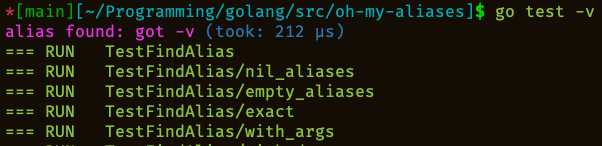

# oh-my-aliases

A ZSH Plugin for suggest exists aliases instead of full command

Inspired by [alias-tips](https://github.com/djui/alias-tips)



# Installation

In the current moment it has status Work In Progress but if you want to try, use this instructions:

### [oh my zsh](https://github.com/robbyrussell/oh-my-zsh)

Go to custom plugins folder:

```shell
cd ${ZSH_CUSTOM1:-$ZSH/custom}/plugins
```

Then make this steps:

```shell
git clone https://github.com/devbackend/oh-my-aliases
```

Then add the plugin to your plugin list in oh-my-zsh configuration:

```sh
$EDITOR ~/.zshrc

plugins=(... oh-my-aliases)
```

After installation re-source your `.zshrc`.

```shell
source ~/.zshrc
```

## Customizations

You can customize plugin by env params in `$HOME/.zshrc` file:

```shell
# enable adding to output some debug info
# default: 0
export ZSH_PLUGINS_OH_MY_ALIASES_DEBUG=1

# enable expand found alias to full command
# default: 0
export ZSH_PLUGINS_OH_MY_ALIASES_EXPAND_ALIAS=1

# enable suggesting for new aliases for frequently used command, which not aliased yet
# default: 0
export ZSH_PLUGINS_OH_MY_ALIASES_SUGGEST_ALIAS=1

# percent of frequency from history for suggestion
# default: 10
export ZSH_PLUGINS_OH_MY_ALIASES_SUGGESTION_FREQUENCY_PERCENT=5
```