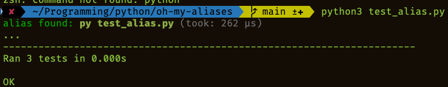

# oh-my-aliases

A ZSH Plugin for suggest exists aliases instead of full command

Inspired by [alias-tips](https://github.com/djui/alias-tips)

# Installation

In the current moment it has status Work In Progress but if you want to try, use this instructions:

## [oh my zsh](https://github.com/robbyrussell/oh-my-zsh)

Go to custom plugins folder:

```shell
cd ${ZSH_CUSTOM1:-$ZSH/custom}/plugins
```

Then make this steps:

```shell
git clone https://github.com/devbackend/oh-my-aliases

cd oh-my-aliases

mkdir $HOME/bin # if not exists

./install.sh
```

Then add the plugin to your plugin list in oh-my-zsh configuration:

```sh
$EDITOR ~/.zshrc

plugins=(... oh-my-aliases)
```

After installation re-source your `.zshrc`.

```shell
source ~/.zshrc
```

## Example

